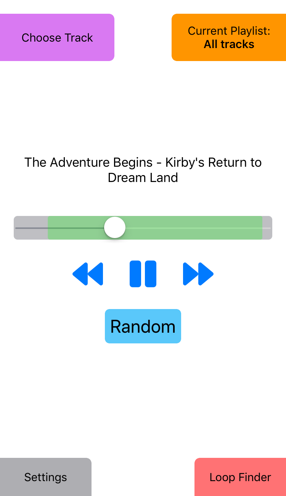

# LoopMusic

LoopMusic is a music player (iOS app) specially designed for songs that can loop indefinitely, the most prevalent example being video game music.

## At a Glance

### Listen to your favorite songs for as long as you want with seamless looping!

    

### Use the automatic loop finder to locate a seamless loop in just a few button presses!

    

## Motivation

Typically, if you want to listen to video game music, you have a few options, each with their own flaws:

1. Listen to a song in-game, either during actual gameplay, or in a [sound test](https://en.wikipedia.org/wiki/Sound_test) mode if one exists. However...
    - Loading up a game to listen to the music is cumbersome and not very portable. It's even worse if the game doesn't have a sound test mode for easy track selection.
    - You're limited to songs from a single game at a time.
    - The audio quality might not be optimal.
2. If one exists, purchase a game's Official Sound Track (OST) to add to your music library. However...
    - Most video game tracks are relatively short, typically somewhere between 30 seconds and 2 minutes long. With a fixed-length audio file, you can't listen to a track for an extended period of time like you can in-game (where playback is usually looped indefinitely) without editing the file yourself.
3. Search for individual songs or compilations that people have uploaded online (for example, on YouTube). However...
    - The fixed-length nature of individual tracks leads to similar downsides as official OSTs.
    - There are fairly common practices to circumvent the fixed-length issue, including the use of "extended" tracks that are manually edited to loop for longer periods of time (often 15-30 minutes), livestreams of curated playlists, and long compilations (usually multiple hours in length). But these all share the same flaws:
        - They are extremely wasteful from a data standpoint
        - There is only limited customizability for the length and choice of songs
        - They rely on having internet access, which hinders portability (or require you to download huge audio files, which is not only a waste of memory, but also of questionable legality).

The specialized capabilities of LoopMusic allow it to avoid all of the aforementioned problems with the game-music-listening experience.

## Specialized Capabilities

- **Seamless looping playback**. That is, the ability to jump from one point in playback to another with zero interruption, which allows you to listen to songs that are looped seamlessly: the way most video game music is meant to be listened to. This allows you to get continuous playback of arbitrary length from a minimally sized audio file.
- **Freely customizable playback times**. Set a song to loop for 5 minutes, 30 minutes, or whatever else you feel like. You can also set songs to loop for a given number of repeats.
- **Automatic loop finding in seconds**. With some heavily optimized signal processing, the built-in automatic loop finding algorithm can analyze full audio waveforms to find near-perfect loop point for songs (usually far better than a human could do manually), allowing jumps in playback that are totally imperceptible to the human ear. Empirically, the loop finder has proven to be extremely robust, and works in its default configuration for the vast majority of video game tracks tested. However, it can also be configured for specialized needs, or used in tandem with manual adjustment to find the perfect loop no matter what the song is (provided it actually has a loop point, of course).

## Basic Usage

### Playing Music

LoopMusic reads your songs and playlists directly from your Apple Music (formerly iTunes) library, so there's essentially no setup to start playing music. You can select tracks with the "Choose Track" button in the top-left corner, and see/change the active playlist with the "Current Playlist" button in the top-right corner.

The current song will be displayed above the playback bar. You can use the media controls to play/pause the current track, scrub through the song playback, scroll through your song history, or pick a random track in the current playlist.

### Customizing Settings

You can tweak settings like volume in the "Settings" menu, accessible through the button in the bottom-left corner. For more details on LoopMusic settings, see the [settings documentation](docs/settings.md).

### Looping Tracks

By default, a song will loop from the very end back to the very beginning. For seamless looping, you will need to locate a good start and end point for the looped region. To do this, open the loop finder with the "Loop Finder" button in the bottom-right (make sure the song is playing first, otherwise the button will be disabled). The steps below are just a brief tutorial. For more details, see the [Loop Finder documentation](docs/loopfinder).

1. To search for a loop, simply click the "Search for Loops" button. The computation may take a few seconds.
2. The results will be displayed in the UI below. You can see the start and end times, as well as the loop duration.
3. By default, the loop finder will provide multiple loop points. You can page through them using the arrow buttons in the "Loop Durations" and "Loop Endpoints" boxes.
4. To test the different loop points, use the "Test Loop" button next to the playback bar.

## Notes

This is an improved version of the [original app written in Objective-C](https://github.com/AnonymousRandomPerson/LoopMusic).