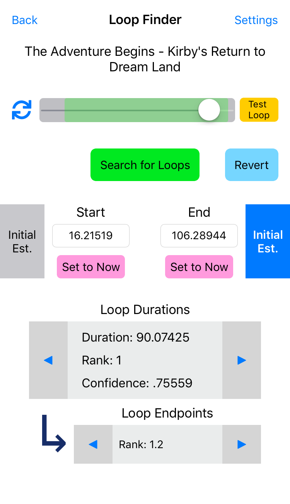

# Loop Finder

This page discusses how to use the Loop Finder. For details on the Loop Finder's [algorithms](loopfinder_algorithms.md) and [settings](loopfinder_settings.md), see the dedicated pages.

    

## General Usage

The active track being looped is displayed at the top of the Loop Finder. You can use the slider to scrub through playback, like on the main screen. The looped region will be highlighted in green.

To run the automatic Loop Finder, simply press the "Search for Loops" button. The algorithm may take a few seconds to run, depending on the song. Upon completion, the loop times will be updated with the results of the Loop Finder. You can also set the loop endpoints manually, either by editing the text boxes with the desired times, or by using the "Set to Now" buttons to set the corresponding endpoints to the current time in playback.

You can then manually verify that a loop is correct and seamless by listening to playback through the loop point. For testing convenience, the "Test Loop" button will set playback close to the loop point, but you can also accomplish the same thing using the scrubber. If at any point you wish to revert back to the original loop (what it was when you first opened the Loop Finder), you can use the "Revert" button.

Once you are satisfied with a loop, simply exit the Loop Finder and return to the main screen using the "Back" button. The currently active loop times will be saved automatically. **Caution: All loops except the active one will be lost upon exiting the Loop Finder, so make sure the right one is selected before exiting.**

## Working with the Loop Finder's Results

By default, the automatic Loop Finder will try to identify multiple different loop points, each a possible candidate for a "good" loop. The results are structured as follows:

- A list of base duration values (approximate time between the two endpoints). Each duration value is assigned a "confidence" value between 0 and 1 representing how "good" the loop duration is, with a value of 1 indicating a perfect loop (more details in the [Loop Finder Algorithms](loopfinder_algorithms.md) page). The list is ranked in order by confidence value, from highest to lowest.
    - *For each base duration value*, a list of loop endpoints (start and end times). The list is ordered from "best" to "worst" by an internal metric (more details in the [algorithms](loopfinder_algorithms.md) page). Note that the actual time between endpoints might vary slightly from their base duration value.

After running the automatic Loop Finder, you can page through the results using the arrow buttons in the "Loop Durations" and "Loop Endpoints" boxes. The arrow buttons in the Loop Durations box will scroll through the outer list of base duration values, with information about the current selection being displayed in the middle of the box. The arrow buttons in the Loop Endpoints box will scroll through the inner list of loop endpoints corresponding to the currently selected base duration value, with the current loop endpoint rank being displayed in the middle of the box.
    - *Note*: You can scroll back past the first loop duration (to "Rank 0") to select the original loop (the automatic Loop Finder's results will not be lost). This has the same effect as using the "Revert" button.

## Initial Estimates

You can optionally run the automatic Loop Finder with initial estimates for the start time, end time, or any combination of the two. Setting an initial estimate will constrain the loop finder to look for loops with endpoints close to the corresponding initial estimates. For a more details on how initial estimates are used by the Loop Finder, see the [Loop Finder Algorithms](loopfinder_algorithms.md) page. For information on configuring the behavior of initial estimates, see the [Loop Finder Settings](loopfinder_settings.md) page.

To toggle initial estimates on or off for a given endpoint, tap the "Initial Est." pane next to the corresponding endpoint time. If the pane is blue when running the Loop Finder, the current endpoint time displayed in the box will be used as an initial estimate for the algorithm. If the pane is gray, no initial estimate will be used.

## Credits

Algorithm research, design, implementation, and UI design by Johann Gan. Original inspiration came from rudimentary work by Cheng Hann Gan.