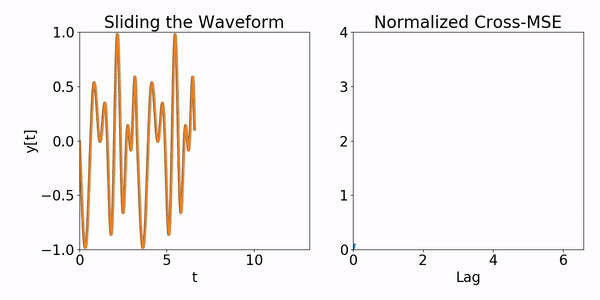
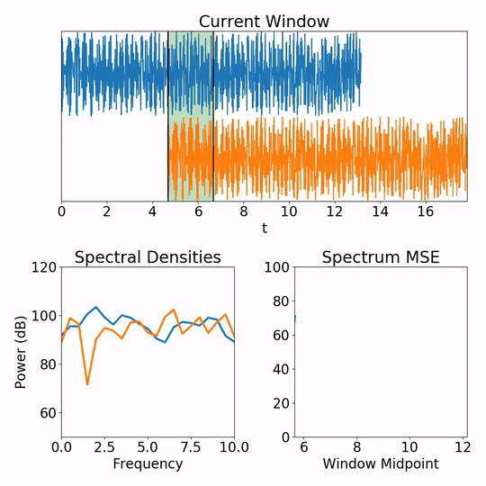

# Loop Finder Algorithms - Core Techniques

This page details the core techniques (and decision decisions, where applicable) underlying the algorithms used by the automatic Loop Finder. For details on the algorithms themselves, see the [Loop Finder Algorithms](loopfinder_algorithms.md) page.

## Sliding Waveform Comparison Techniques

    

These techniques involve "sliding" one waveform across another (by varying the temporal offset). At each possible offset (or the "lag"), a comparison metric (a number) is computed that summarizes how similar the overlapping audio regions are for the given offset. If comparing an audio waveform to *itself* using these techniques, the offset between the two copies corresponds to the loop duration. Given the comparison metrics for all offsets, the Loop Finder can identify the most promising loop durations by looking for offsets where the waveform is very similar to itself (because the repeated sections "line up").

### Cross-Correlation

[*Cross-correlation*](https://en.wikipedia.org/wiki/Cross-correlation), also called a sliding dot product, is a well known signal processing technique that involves taking the dot product between two overlapping signals as they're slid across each other. The output cross-correlation function gives a single number (the dot product) for every lag value. If the cross-correlation is high for a given lag value, that indicates that the signals line up well with each other when offset by that lag value. The term *autocorrelation* refers to the cross-correlation of a signal with itself, which is a useful technique for identifying repetition within a single waveform.

Cross-correlations can be implemented efficiently through [fast Fourier transforms (FFTs)](https://en.wikipedia.org/wiki/Fast_Fourier_transform) with a time complexity of **O[N × log(N)]** in the larger of the two signal lengths **N**.

As a side note, cross-correlation is similar to [convolution](https://en.wikipedia.org/wiki/Convolution), except that convolution involves time-reversing one of the signals while cross-correlation doesn't. When people talk about "convolution" in a machine learning context, what they often mean is cross-correlation.

### Cross-SSE

What I call a "cross-sum-of-square-errors" or *cross-SSE* (referred to in the code as a "sliding SSE") is a technique similar to cross-correlation except that a sum of square differences between signals is computed instead of a dot product (a sum of pairwise products between signals) for each lag value. The cross-SSE can be computed as a cross-correlation plus some quick-to-compute (**O[N]**) extra terms, so it can be computed efficiently just like the cross-correlation.

#### Motivation

Because cross-correlation involves taking dot products, it tends to focus on correlation between the big fluctuations, while de-emphasizing correlations between smaller fluctuations. This is because a large peak times another large peak gives a large contribution to the cross-correlation, while a small peak times a small peak gives a lesser contribution, even if the two small peaks show a similar degree of similarity to the two large peaks. This is desirable in common signal processing contexts, such as analyzing seismic activity or market fluctuations, because the "signal" of interest is generally the places where fluctuations are big, while smaller fluctuations are typically "background noise" that should be ignored.

However, in the context of searching for self-similarity in music tracks, where the volume can vary significantly throughout the piece, *all* parts of the waveform (loud or soft) are equally important. De-emphasizing the softer parts of a track like in cross-correlation would be to misrepresent the overall structure of the waveform, thereby throwing out a lot of vital information that is important when trying to identify lag values with high precision. Hence, cross-SSE is a better technique than cross-correlation in this case. By adding square differences rather than products, big peaks and small peaks are treated more equally. Small peaks lining up (or not) will have just as strong of an effect as big peaks lining up (or not), provided the absolute differences between the compared peaks are the same. As a particularly extreme example, perfectly aligned peaks will have different cross-correlations depending on how big they are, but the cross-SSE will always be zero.

### Cross-MSE

What I call a "cross-mean-squared-error" or *cross-MSE* is the same as the cross-SSE, except that the SSE for each lag value by the length of the overlap region between the two waveforms (this varies with the lag value).

#### Motivation

A raw SSE value will naturally be larger when comparing two signals over a longer period of time, even if the degree of similarity is fixed throughout that period, just because there are more terms to add together. This effect is normalized out in MSE values, which is desirable in this case because the interest is in identifying how similar one signal is to another at some point, *without regards to how big the similarity region is*.

### Normalized Cross-MSE

What I call a *normalized cross-MSE* (referred to in the code as a "sliding weighted MSE") is the same as the cross-MSE, except that the MSE for each lag value is normalized by the average power (square-amplitude) of the two signals within the overlap region (this varies with the lag value). In practice, the average power is regularized by adding a small value (10-3) to prevent division by zero. Similar to autocorrelation, the term *normalized auto-MSE* (abbreviated in the code as simply "auto-MSE") refers to the normalized cross-MSE of a signal with itself.

#### Motivation

While the cross-SSE/MSE is less biased towards large fluctuations compared to cross-correlation, it overcompensates and instead favors small fluctuations. This is because SSE/MSE values will tend to be larger for louder sections of audio. As volume (waveform amplitude) is scaled up, any discrepancies between the two waveforms due to misalignment will also be magnified by the same factor. To correct for this effect, it is good to normalize the MSE values by the average power (average square amplitude; it's squared because the MSE itself comes from squared quantities) of the two waveforms within the overlap region.

## Spectral Analysis Techniques

    

These techniques involve analyzing the [spectral density](https://en.wikipedia.org/wiki/Spectral_density) functions, which provide a robust way to inspect the harmonic content of a chunk of audio while largely ignoring phase information in the raw waveform. This is important because the phase of the waveform can be noisy in some audio files (either due to discretization or other sources of noise), which can cause problems for direct waveform comparison techniques (which are highly sensitive to phase). The Loop Finder primarily uses this for identifying loop regions (the part of the song that actually gets repeated) after a loop duration has already been identified.

### Spectrograms

A [spectrogram](https://en.wikipedia.org/wiki/Spectrogram) summarizes the harmonic content of a waveform at every point in time. More precisely, it is a collection of power spectra for a waveform over time, with one spectrum per "chunk" of time (called a *window*). The length of one window, called the *window size*, is configurable. Windows can have some amount of overlap with one another, which is also configurable.

#### Windowing

In typical applications, a fade-in and fade-out is applied to each chunk of audio via a [window function](https://en.wikipedia.org/wiki/Window_function). This is called *windowing*, and is helpful for technical reasons. However, after empirical testing of various window functions (including [Hamming](https://en.wikipedia.org/wiki/Window_function#Hann_and_Hamming_windows), [Hann](https://en.wikipedia.org/wiki/Window_function#Hann_and_Hamming_windows), [Kaiser](https://en.wikipedia.org/wiki/Window_function#Kaiser_window), [Welch](https://en.wikipedia.org/wiki/Window_function#Welch_window), [exponential](https://en.wikipedia.org/wiki/Window_function#Exponential_or_Poisson_window)), the most effective method for the Loop Finder's case was, surprisingly, to use a [rectangular window](https://en.wikipedia.org/wiki/Window_function#Rectangular_window)—that is, not windowing at all.

#### Smoothing

Since spectral densities of real audio can be messy, the Loop Finder performs some smoothing on spectra before using them for analysis. The smoothing technique is simple rectangular smoothing, which just means that each value in the spectrum is replaced by the average across all its neighboring values within a configurable radius (which default to 2).

### Spectrum MSE

What I call a "spectrum mean squared error" or *spectrum MSE* is a simple way to quantify how harmonically different one chunk of audio is from another. It involves computing the power spectrum of each audio chunk, then finding the mean squared difference between corresponding bins in the two spectra. Differences are computed on a log scale (so in units of decibels) because it better reflects the relative volume of different parts within a song, as perceived by the human ear.

#### Volume Thresholding

Since power spectra are computed in decibels, the very quiet parts of spectra tend to have a significant effect on the spectrum MSE. This is not ideal, since extremely quiet parts in a song aren't very important when trying to evaluate if two sections of audio sound the same. Additionally, quiet parts of spectra tend to be less accurate and dominated by random noise. To combat this, spectrum MSEs are computed with volume thresholding. This means omitting any bins that are too far (at least 60 dB) below the full track's average volume in both chunks of audio being compared, for the purposes of computing the spectrum MSE.